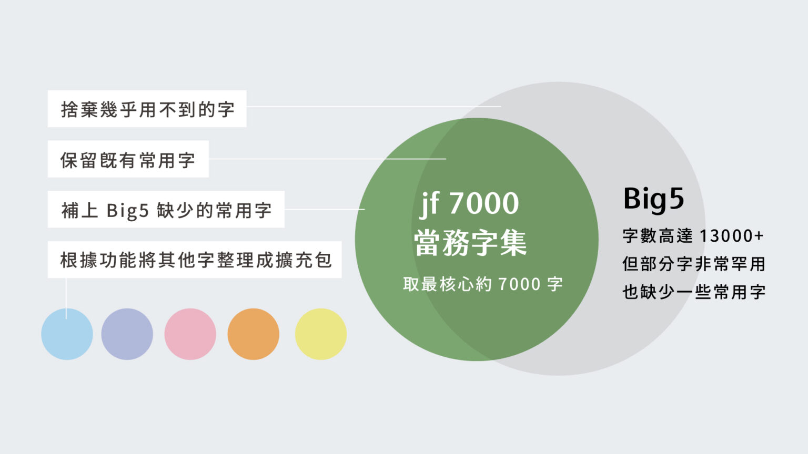

# jf 7000 當務字集

[![CC BY-SA 4.0][cc-by-sa-shield]][cc-by-sa]

### 精簡、實用、可自由擴充，為台灣情境設計的全新繁體中文字集

### jf 7000 - A Traditional Chinese Charset designed for Taiwan

jf 7000 當務字集由 justfont 整理推出。針對台灣用字需求審訂，以最核心常用的 7000 字為主體，搭配不同用途的擴充包，打造字數恰好、兼顧基本使用與擴充彈性的新字集，讓台灣的字型陣容更多元，也讓創作者可依目標自選擴充範圍，取得造字時間與支援程度的平衡。

The *jf 7000 Traditional Chinese Charset* is collected and released by justfont. Tailored to meet the specific needs of Taiwanese users, this charset focuses on the 7,000 most commonly used Traditional Chinese characters. It also includes expansion packs for various purposes, such as naming pack, creating a balanced typeface that supports both basic use and flexible expansion. 

## 想設計一套字型，要造幾個字才夠？

要依據哪個「字集」造字，是 justfont 輔導的獨立設計師常遭遇的困難。

What character set should you use for font creation a Traditional Chinese font? This is a common challenge faced by independent designers working with justfont.

「字集」規範了一套字型要做多少字、有哪些字（[建議閱讀：什麼是「字集」？](https://blog.justfont.com/2023/06/charactersets/)）。目前最通行的繁中字集 Big5 為求能支援絕大多場合，收錄字數高達 13000 以上。字數雖多，其中卻包含許多罕用字，也因年代久遠，缺少如 `獴`、`蟎`、`㹴` 等現代常用字，如果依表造完往往事倍功半。

A “character set” defines how many and which characters are required for a font. The most widely used Traditional Chinese character set, Big5, includes over 13,000 characters to cover a wide range of scenarios. Although it contains many characters, it also includes rare ones and lacks modern characters like 獴, 蟎, 㹴, etc. If you follow this set, you often end up with unnecessary characters and missing commonly used ones.

況且，並非所有字型都是以內文排版為目標，字集選擇也應該有精簡而彈性的方案。因此我們精煉整理出約 7000 字的「基本包」，並將不同功能字集（如本土語言、命名常用字......等）整理為數百字的「擴充包」，推出 jf 7000 當務字集，並免費開源釋出提供各界使用。期待能支援有志造字的獨立設計師，讓造字漫漫長路更加順利。

Moreover, not all fonts are designed with body text typesetting as the goal. Character set selection should also offer a simplified and flexible solution. Therefore, we have refined and organized a “core package” of about 7,000 characters and categorized additional sets (such as local language characters, commonly used naming characters, etc.) into “extension packages.” We introduce the jf 7000 Core Character Set, which is open-source and free for use. We hope this will support independent designers and make the font creation journey smoother.

## 基本包與擴充包

jf 7000 當務字集分為「基本包」與「擴充包」。基本包收錄核心用字，只要造完基本包中的文字，就能支援大多數台灣使用情境。「擴充包」則收錄「本土語言常用包」、「臺灣命名常用包」、「日文常用包」、「港澳常用包」、「符號擴充包」等擴充字集，供設計師自由選配。

The jf 7000 Core Character Set is divided into “core packages” and “extension packages.” The core package includes essential characters, which, when completed, will cover most scenarios in Taiwan. The extension packages include “local language packages,” “Taiwan naming packages,” “Japanese common character sets,” “Hong Kong and Macau common character sets,” “symbol extension packages,” etc., for designers to freely select.

## 團隊與篩選原則

計畫由 justfont 團隊計畫主導，編輯委員則邀請到《字型散步》作者柯志杰（a.k.a. [芫荽字型](https://github.com/ButTaiwan/iansui)、源系列思源改作設計師兼字嗨版主 But Ko ）與 justfont 多套字型台語文顧問陳建中共同編輯整理。

The project is led by the justfont team, with editorial contributors including Zhi-Jie Ko (also known as 芫荽字型, designer of the Source series and moderator of facebook group 字嗨) and justfont's Taiwanese language consultant, Tân Kiàn-Tiong.

收錄原則包含教育部常用字表及各大字型公司之共通字，另也補充收錄字如台灣地名路名、大考中心榜單與生活常見用字等。各語言、符號及命名常用字則由計畫團隊彙整編輯。詳細收錄規範與介紹請至 justfont blog 專文閱讀。（[延伸閱讀：隆重宣佈｜jf 7000 當務字集公開測試中！](https://blog.justfont.com/2023/07/jf7000)）

The inclusion principles include common characters from the Ministry of Education’s list and shared characters from major font companies. Additional characters such as Taiwanese place names, university entrance examination lists, and commonly used characters in daily life are also included. The language, symbol, and naming sets are compiled by the project team. 

## 專業字集募集中！敬邀領域專家

在整理字集的過程中，我們發現：許多文字雖不常見於生活中，但在特定領域不可或缺。例如：字型希望支援鳥類圖鑑的編製，就需要收錄許多「鳥字邊」的漢字；若要設計能支援課本編排的字型，或許就需要造完大考範圍之「核心古文」及「理化、數學課本」中會用到的漢字與特殊符號。

During the process of organizing the character sets, we found that while some characters are rarely used in daily life, they are essential in specific fields. For example, a font supporting birdwatching guides would need many “bird-related” characters; a font for textbooks may require characters and special symbols from subjects like classical literature and chemistry.

jf 7000 當務字集希望字集不僅是以過往慣用的「語言」、「常用頻率」制定，而能以「功能」出發，因此非常期待能透過本計畫拋磚引玉，邀請各領域專家提供專業用字的見解，協助我們整理專業用途字集，提供有志造字的設計師指引，讓台灣未來的字型提案有更多可能性。

The jf 7000 Core Character Set hopes to not only be based on common language or frequency but also on “functionality.” Therefore, we look forward to inviting experts from various fields to contribute professional character suggestions and help organize specialized character sets, providing designers with guidance and expanding the possibilities for future font proposals in Taiwan.

- 您是鳥類專家？歡迎協助整理鳥類相關名稱用字
  - **鳥類包** 可能有：`鸌`、`鳦`、`鳱`、`鳾`、`鵷`、`鷚`、`䴉`等字
- 研究化學領域？歡迎協助整理相關專有名詞常用字
  - **化學包** 可能有：`苄`、`醌`、`焓`、`鋞`、`呋`與週期表等字
- 在學校教國文？歡迎協助整理大考古文常用字詞
  - **古文包** 可能有：`邙`、`譖`、`敧`、`詘`、`跽`、`鏦`、`饘`等字
- 敬請協助整理各領域專業常用字，有任何想法，歡迎填表給予建議！

- Are you a bird expert? Help us organize bird-related character names! Possible bird characters: 鳌, 鳦, 鳱, 鳾, 鵷, 鷚, 䴉, etc.

- Researching chemistry? Help us organize related terminology characters! Possible chemistry characters: 苄, 醌, 焓, 鋞, 呋, and elements from the periodic table.

- Teaching Chinese literature? Help us organize commonly used characters from ancient texts! Possible ancient literature characters: 邙, 譖, 敧, 詘, 跽, 鏦, 饘, etc.

專業擴充字集方向包含但不限於上表之舉例，持續誠摯邀請各路專家支援！

Please assist us in organizing domain-specific characters! If you have suggestions, feel free to fill out the form and share your ideas! The direction of specialized extension character sets includes but is not limited to the examples above. We sincerely invite experts to support this effort!

截至 2025 年三月，目前收集之社群專家建議結果整理如下表，包含「追星應援包」、「化學包」、「生態包」等，歡迎到[專業擴充包](https://docs.google.com/spreadsheets/d/1ZWKXlznegMBjy0vYsSFatWhTNq0Nt6-_t3j_UyCUm5U/edit?usp=sharing)頁面查看。

As of March 2025, suggestions from community experts are summarized in the table below, including “Fanbase Support Packages,” “Chemistry Packages,” and “Ecology Packages.” Please visit the professional extension package page for more details.

若您有意提供「領域專業字集」之建議，都歡迎繼續填表回報，非常感謝您的協助！收到回覆後，團隊將再討論決議後以信件回覆您是否增收等相關後續。若您的建議收錄採納，我們將註明您為貢獻者，並整理更新。

If you would like to contribute to a specialized character set, please continue to submit your feedback. Thank you for your help! Once we receive your reply, the team will review it and notify you of any updates. If your suggestion is adopted, we will credit you as a contributor and update the list accordingly.

# 釋出與下載

未來 justfont 出品之字型產品皆將支援本字集之基本包範圍。過往字型產品亦將漸漸補齊基本包範圍。

All future justfont products will support the basic character set range of this collection. Past font products will gradually incorporate this basic character set range.

目前釋出之檔案為 Glyphs 字集清單 ，需於 Glyphs 中方可使用。因字集內有部分字符沒有專屬 Unicode 編碼（[延伸閱讀：Unicode 簡介](https://learn.justfont.com/pocketbook/font-tech/unicode)），故需以清單格式呈現避免字符遺漏。

Currently, the released file is a Glyphs character list that can only be used in Glyphs. Since some characters in the set do not have dedicated Unicode encoding (for more on Unicode: Introduction to Unicode), we present the list in a format to prevent character loss.

若無使用 Glyphs 軟體，您也可以進入[網頁試算表](https://docs.google.com/spreadsheets/d/1yI9O2_nlEjP28McIXPJS8GO2U9yVBbnZIvlDFyCKV18/edit?usp=sharing)版本，或是[下載純文字檔案版](https://github.com/justfont/jf7000/releases)本瀏覽字集分包，並以搜尋功能快速查找特定字符。但需注意，因上述編碼問題，直接複製網頁或文字版字表將有部分字符遺漏，故建議僅供參考使用。

If you're not using Glyphs software, you can also access the web-based version or download a plain text file to browse the character set packages and quickly search for specific characters. However, please note that due to encoding issues, directly copying from the webpage or text version will result in some characters being omitted. It is recommended for reference only.

 

# LICENSE

本字集以 CC BY-SA 4.0 開源釋出，免費開放給各單位自由使用。

This character set is open-sourced under CC BY-SA 4.0 and is freely available for use by all organizations.

盼此計畫能成為獨立設計師造字路上的助力。

We hope this project can become a helpful resource for independent font creators.

若在使用上遇到任何疑惑，都歡迎來信 [just@justfont.com](mailto:just@justfont.com) 聯絡洽詢。

If you have any questions or doubts about using the character set, please feel free to contact us at just@justfont.com.

This work is licensed under a
[Creative Commons Attribution-ShareAlike 4.0 International License][cc-by-sa].

[![CC BY-SA 4.0][cc-by-sa-image]][cc-by-sa]

[cc-by-sa]: https://creativecommons.org/licenses/by-sa/4.0/
[cc-by-sa-image]: https://licensebuttons.net/l/by-sa/4.0/88x31.png
[cc-by-sa-shield]: https://img.shields.io/badge/License-CC%20BY--SA%204.0-lightgrey.svg

---

# 關於 justfont

justfont 官方網站 👉  [https://justfont.com](https://bit.ly/40Lj9bJ)

字體不但佔據閱讀的目光，也引導了生活中的每個決定。字體更構築了城市街道的風景，是關乎美感，最重要的視覺纖維。在人人都能用字型的時代，更能透過方便的科技，將專家職人的心血結晶應用在生活中。

可惜，臺灣長期以來，不論學院或產業，字體都未能得到足夠關注，也缺乏深度耕耘。不僅導致設計從業者能力斷層，一般民眾也對每日都會用到的字體缺乏認識。長久以往，街道上充斥不易理解、不甚美觀的字體排印。版權觀念薄弱，盜版盛行，更導致字型廠商在消費端無立足之地，紛紛轉型或外移。如此負向循環，讓臺灣的「文字風景」難以起色。

justfont 相信字體的價值，更相信好的字體能啟發社會。除了細心栽培一筆一劃，我們更願做字體推廣教育的先行者、教育者與輔導者，致力於培育臺灣下一代的設計力量。從基礎建設與教育開始，提升臺灣的美學環境。邀請您一起來，創造更好的文字風景。

justfont believes in the value of fonts and that good fonts can inspire society. Beyond carefully crafting every stroke, we are committed to being pioneers in font promotion, education, and guidance, aiming to nurture Taiwan’s next generation of design talent. Starting with infrastructure and education, we aim to enhance Taiwan's aesthetic environment. Join us in creating better typography!
